# Pulse v3.0 Architecture
## Collaborative AI Trading Intelligence Platform

> **Version**: 3.0.0
> **Status**: Development
> **Last Updated**: 2026-01-02

---

## System Overview

Pulse v3.0 is a next-generation trading intelligence platform that combines collaborative AI agents, real-time market analysis, and automated trading proposals with human-in-the-loop validation.

### Core Components

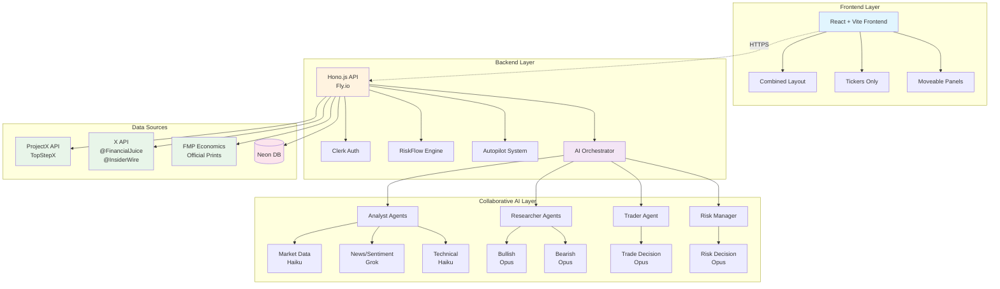

---

## RiskFlow Architecture

RiskFlow is the real-time market intelligence feed that powers trading decisions.

### Data Flow

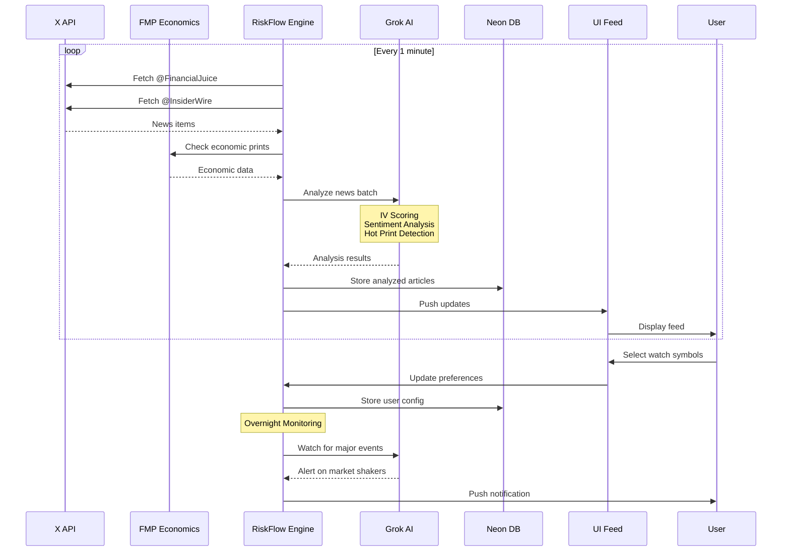

### RiskFlow Data Schema

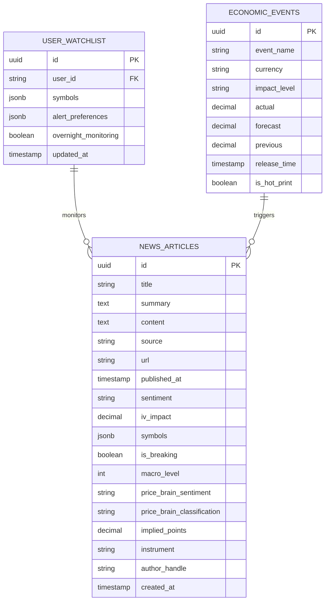

---

## Collaborative AI Pipeline

The multi-agent system processes market data through specialized agents working in concert.

### Agent Execution Flow

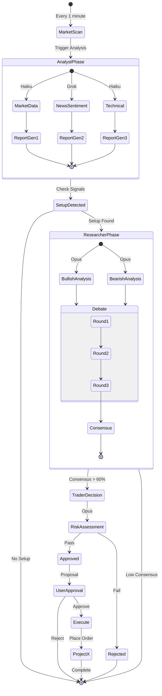

### Agent Communication Protocol

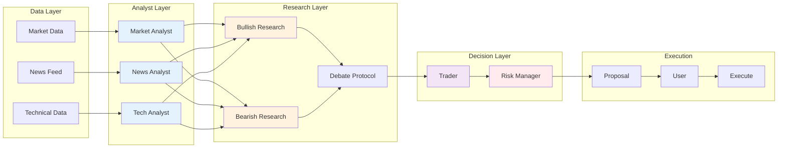

---

## Trading Strategy Engine

Five core strategies implemented with specific entry/exit criteria.

### Strategy Activation Matrix

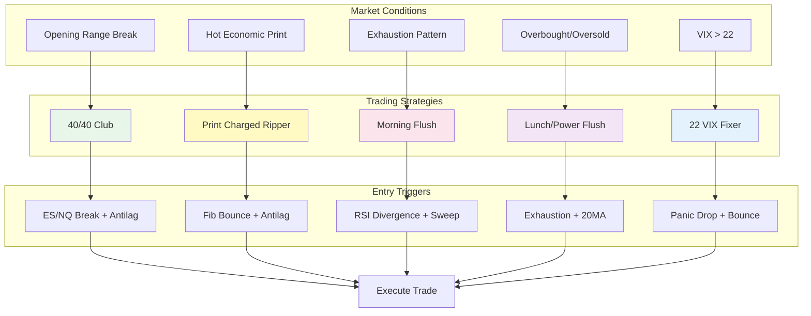

### Antilag Detection System

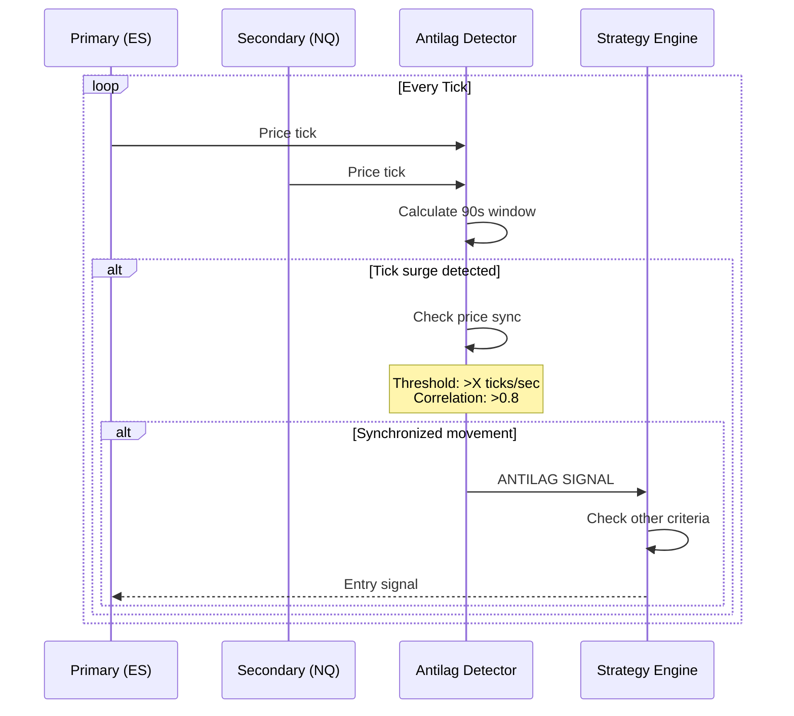

---

## Autopilot System

Semi-autonomous trading with human approval workflow.

### Proposal Lifecycle

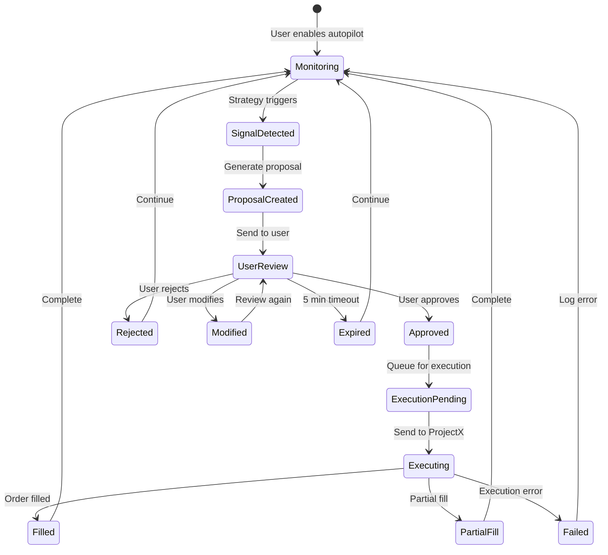

### Overnight Monitoring

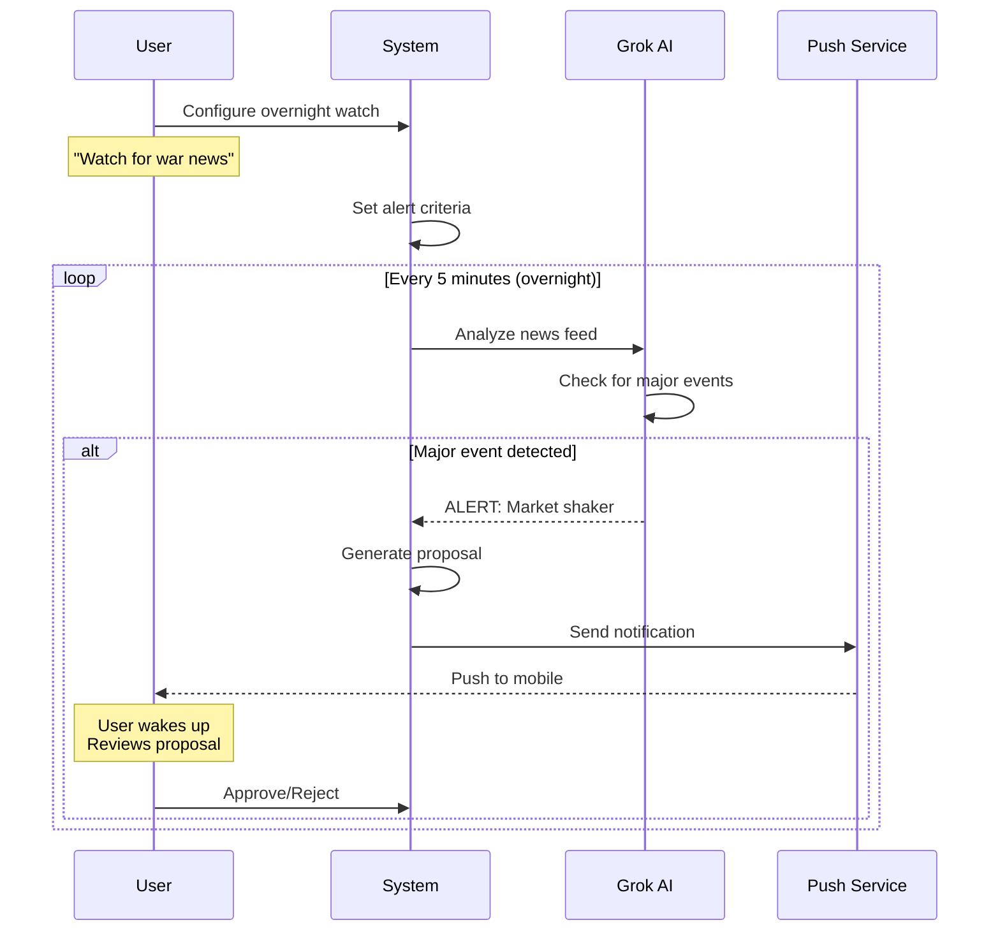

---

## Frontend Layout Architecture

Three layout modes with RiskFlow integration.

### Layout Mode Transitions

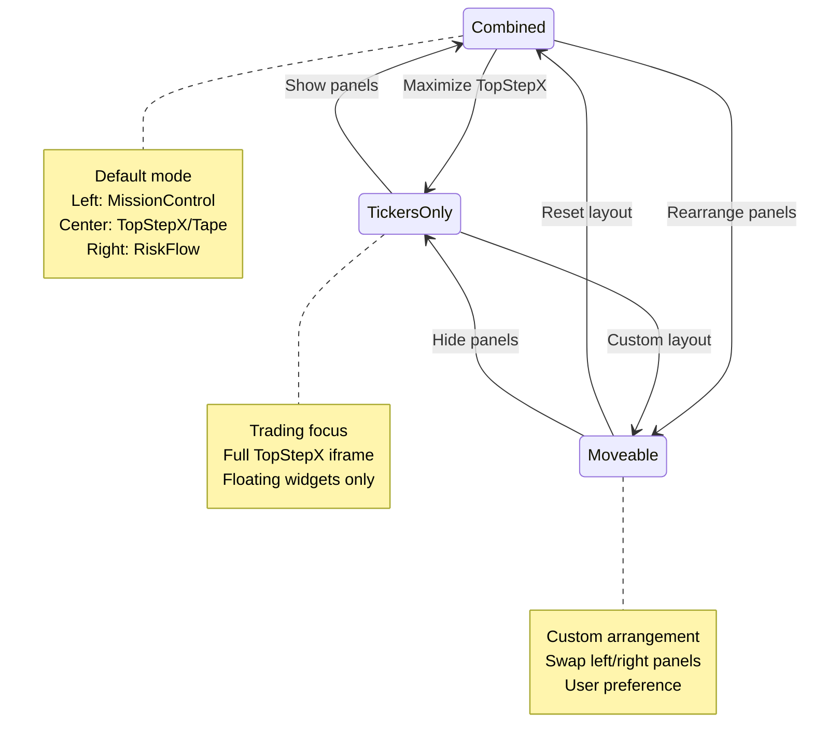

### Component Hierarchy

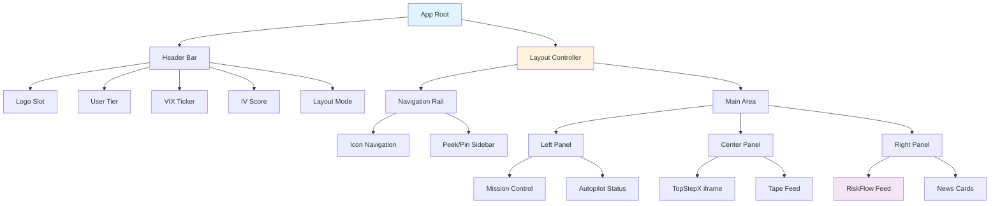

---

## Performance Targets

### Latency Requirements

| Component | Target | Maximum |
|-----------|---------|---------|
| RiskFlow refresh | 60s | 90s |
| Analyst agents | 5s | 10s |
| Debate cycle | 30s | 45s |
| Full AI pipeline | 45s | 60s |
| Proposal generation | 2s | 5s |
| Order execution | 500ms | 2s |
| QuickPulse analysis | 3s | 5s |
| Chat response | 3s | 5s |

### Scalability Metrics

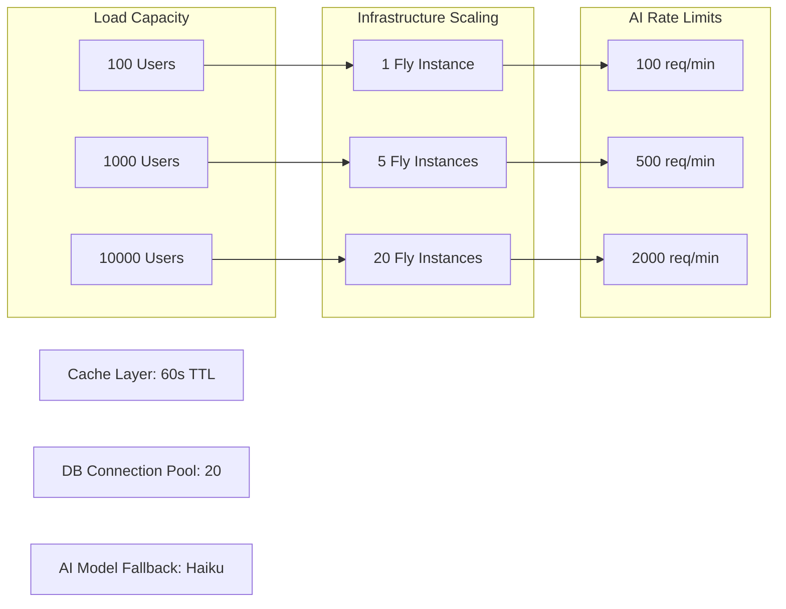

---

## Security Architecture

### Authentication & Authorization

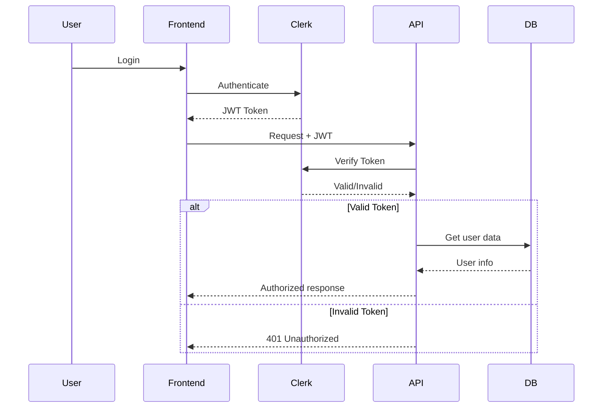

### Data Security Layers

1. **Transport**: HTTPS/TLS 1.3
2. **Authentication**: Clerk JWT with 15-min expiry
3. **Database**: Encrypted at rest (Neon)
4. **Secrets**: Fly.io secret management
5. **API Keys**: Environment variables only
6. **Trading**: Human approval required

---

## Deployment Architecture

### Infrastructure Components

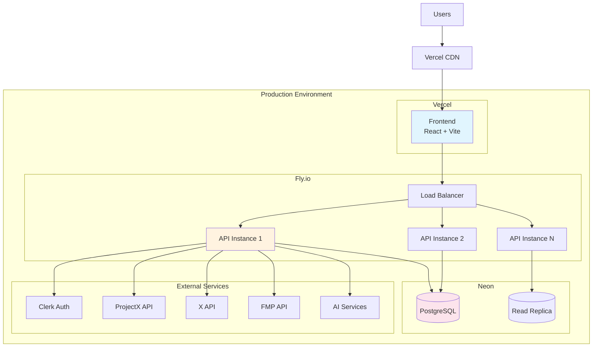

---

## Monitoring & Observability

### Health Check Endpoints

- `/health` - Basic health check
- `/health/db` - Database connectivity
- `/health/ai` - AI services status
- `/health/projectx` - ProjectX API status
- `/metrics` - Prometheus metrics

### Key Metrics to Monitor

1. **API Performance**
   - Request latency (p50, p95, p99)
   - Error rates by endpoint
   - Active connections

2. **AI Pipeline**
   - Agent execution times
   - Token usage by model
   - Pipeline success rate

3. **Trading Metrics**
   - Proposals generated/approved/rejected
   - Order execution success rate
   - Strategy performance

4. **RiskFlow**
   - Feed update latency
   - News processing rate
   - IV scoring accuracy

---

## Technology Stack

### Backend
- **Runtime**: Node.js 20 LTS
- **Framework**: Hono.js
- **Database**: Neon PostgreSQL
- **Cache**: Redis (future)
- **Queue**: BullMQ (future)

### Frontend
- **Framework**: React 18
- **Build**: Vite
- **Styling**: Tailwind CSS
- **State**: React Context
- **Charts**: Recharts

### AI/ML
- **Claude Opus 4.5**: Complex reasoning
- **Claude Haiku 4.5**: Fast analysis
- **Grok**: News interpretation
- **Vercel AI SDK**: Orchestration

### Infrastructure
- **Frontend Host**: Vercel
- **Backend Host**: Fly.io
- **Database**: Neon
- **Auth**: Clerk
- **Trading**: ProjectX API

---

## Future Enhancements

### Phase 1 (Q1 2026)
- WebSocket for real-time updates
- Redis caching layer
- Advanced risk analytics

### Phase 2 (Q2 2026)
- Options trading support
- Multi-account management
- Custom strategy builder

### Phase 3 (Q3 2026)
- Mobile app (React Native)
- Voice commands
- AI strategy optimization

### Phase 4 (Q4 2026)
- Institutional features
- White-label solution
- Advanced backtesting

---

**End of Architecture Document**