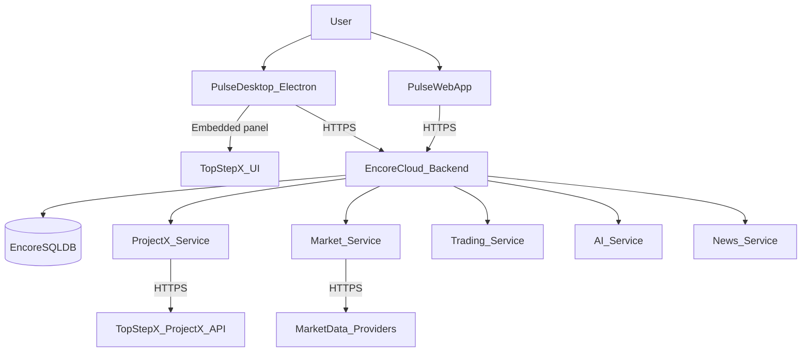
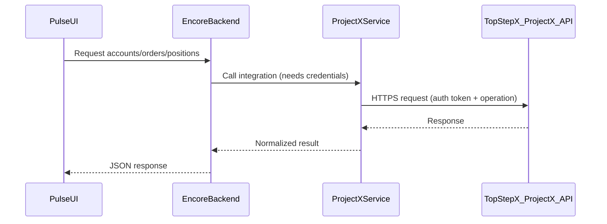
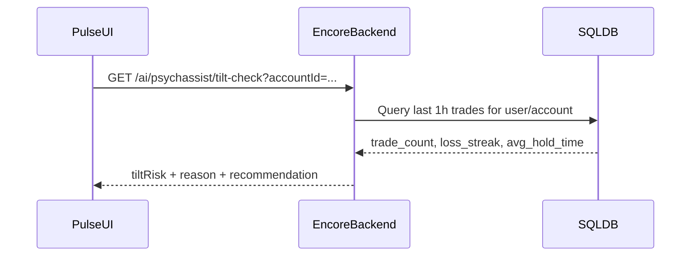

### Pulse Architecture (v2.23.1)

This doc explains how Pulse is structured and how the pieces talk to each other. It’s written for an operator/finance mindset: “what is this component, why does it exist, and what can break it?”

---

### What we ship

- **Cloud backend (Encore)**: the deployable backend that exposes typed APIs, runs migrations, and integrates with TopStepX (ProjectX) and other providers.
- **Desktop app (Electron DMG)**: a separate desktop shell that loads Pulse in one pane and TopStepX in an “integrated panel”.
  - The desktop app is a UI container; it still uses the same cloud backend.

---

### High-level system diagram

---

### Repo layout (important folders)

- **`backend/`**: Encore app root (deployable)
  - **`backend/encore.app`**: Encore app config (app id, language, CORS)
  - **`backend/db/`**: SQL DB handle + migrations
  - **`backend/projectx/`**: TopStepX / ProjectX integration (auth, orders, positions, realtime helpers)
  - **`backend/market/`**: market endpoints
  - **`backend/trading/`**: trading endpoints (order execution/orchestration)
  - **`backend/ai/`**: PsychAssist (“tilt detection”) endpoints + related migrations
  - **`backend/news/`**: retry utilities used by other integrations
- **`knowledge-base/`**: static docs used by the product/AI features

---

### Core backend services (what they do)

#### `db` (SQL database)
- **What it stores**: accounts, trades, and AI coaching tables like `ntn_reports` (depending on migrations).
- **What can break it**:
  - Missing migrations or schema drift (Encore will run migrations during deploy).

#### `projectx` (TopStepX integration)
- **What it does**:
  - Auth to TopStepX ProjectX API
  - Account/order/position APIs
  - Optional realtime support (SignalR/WebSocket style hubs)
- **Credential model**:
  - Primary: **Encore secrets** `ProjectXUsername` + `ProjectXApiKey`
  - Fallback: DB fields (plaintext only). If DB values look encrypted, the backend rejects with a clear error (we intentionally do **not** require an `EncryptionKey` secret to deploy).

#### `market`
- **What it does**: market data endpoints used by the UI and automation.
- **What can break it**: provider rate limits, missing provider credentials, or realtime dependencies if started at boot.

#### `trading`
- **What it does**: trade execution / order orchestration (often forwards into `projectx`).
- **What can break it**: missing ProjectX creds, external API failures.

#### `ai` (PsychAssist)
- **What it does**: behavioral guardrails (tilt risk checks, recommendations).
- **What can break it**: missing DB tables (`trades`) if your schema isn’t aligned.

---

### Startup and “health check” rules (cloud deploy stability)

Encore deploy health checks expect the service to **start quickly** and be able to accept requests.

Rules we follow to keep deploys stable:
- **No network calls on module import** (no “auto-connect on load”). Any external connections should be initiated inside request handlers or explicit background jobs.
- **Secrets should not be required unless necessary**. If a feature is optional, code should degrade gracefully instead of making deploy fail.

---

### Request flows (how it behaves)

#### ProjectX API call flow

#### Tilt check (PsychAssist)

---

### Deployment model

- **Deploy target**: `backend/` only (Encore Cloud + GitHub)
- **What deploy does**:
  - Builds TypeScript services
  - Applies DB migrations
  - Starts the runtime and runs health checks

Recommended operational checklist:
- Confirm secrets: `ProjectXUsername`, `ProjectXApiKey` (if you want global ProjectX integration)
- Confirm DB migrations apply cleanly
- Avoid any “connect at import time” patterns
