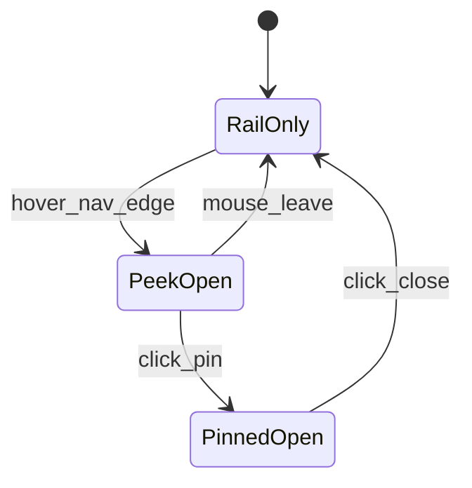
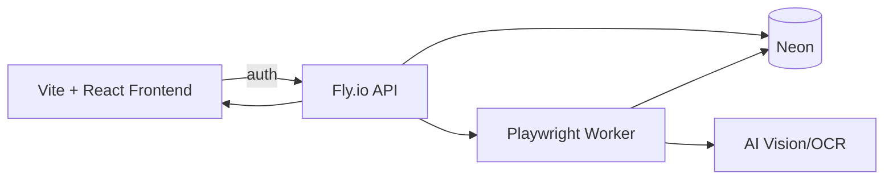

# Pulse — Final Layout & UX Blueprint (Lucide-only, KPI-gradient-only)

> **Purpose**: This is the **final, visually descriptive** reference for the Pulse frontend layout (Vite + React). It preserves the 3 layout modes and adds **NavRail + Peek/Pin Sidebar**, plus the new **RiskFlow / Journal / Econ Calendar** requirements.
>
> **Hard rules**:
> - **No emojis** anywhere.
> - **Lucide icons only** (no gradient fills on icons/cards).
> - **Gradients allowed only inside KPI graphs** (Area-line fills), not on cards/buttons/icons.
> - Panels collapse/expand **from sides** only.

---

## Lucide Icon System (no gradients)

| UX Element | Lucide Icon | Notes |
|-----------|-------------|------|
| Nav: The Tape | `Newspaper` | Primary section |
| Nav: Price | `Bot` | AI agent |
| Nav: Risk Flow | `TrendingUp` | RiskFlow section |
| Nav: Journal | `BookOpen` | Journal section |
| Nav: Econ Calendar | `Calendar` | Econ section |
| Profile | `UserCircle` | Bottom of sidebar |
| Settings | `Settings` | Bottom of sidebar |
| Logout | `LogOut` | Bottom of sidebar |
| Peek/Pin | `Pin` | Pins the sidebar open |
| Close | `X` | Close pinned sidebar |
| Collapse Left Panel | `ChevronsLeft` | Horizontal collapse |
| Collapse Right Panel | `ChevronsRight` | Horizontal collapse |
| Bullish indicator | `TrendingUp` | Color only (green) |
| Bearish indicator | `TrendingDown` | Color only (red) |
| Neutral indicator | `Minus` | Color only (gray) |
| Macro alert | `Zap` | Color only (gold) |

---

## Global App Skeleton (All Layout Modes)

```text
┌──────────────────────────────────────────────────────────────────────────────────────────────────────┐
│ [LogoSlot(GIF)]  {UserTier}   [Pill_TopStepX]   VIX:{value}   [LayoutMode▼]                   IV:{s} │
│  (custom gif)     (name label) (CTA pill)       (ticker)      (combined/tickers/moveable)   (badge) │
├───────────────NavRail──────────┬──────────────LeftPanel───────────────┬────────Main────────┬Right───┤
│ icons only (always visible)    │ collapses from LEFT edge (horizontal) │ TopStepX OR Tape   │ Tape    │
│ + hover-peek opens label panel │ (MissionControl / RiskFlow tools)     │ (depends on mode)  │ (coll.) │
└──────────────────────────────────────────────────────────────────────────────────────────────────────┘
```

---

## Navigation: Rail + Peek/Pin Sidebar (Hybrid)

### A) Always-visible NavRail (icons only)

```text
┌─────NavRail─────┐
│ [Newspaper]     │  The Tape
│ [Bot]           │  Price
│ [TrendingUp]    │  Risk Flow
│ [BookOpen]      │  Journal
│ [Calendar]      │  Econ Calendar
│                 │
│ [UserCircle]    │  Profile (avatar)
│ [Settings]      │  Settings
│ [LogOut]        │  Logout
└─────────────────┘
```

### B) Peek/Pin Sidebar (labels + descriptions)
- **Hover** on the left edge (or rail) → **peek** opens.
- **Click Pin** → sidebar becomes **pinned** until closed.

```text
Peek/PinSidebar (slides out from LEFT)
┌───────────────────────────────────────────────┐
│ [Pin]  Navigation                             │
├───────────────────────────────────────────────┤
│ [Newspaper]  The Tape                         │
│ [Bot]        Price                            │
│ [TrendingUp] Risk Flow                        │
│ [BookOpen]   Journal                          │
│ [Calendar]   Econ Calendar                    │
├───────────────────────────────────────────────┤
│ [UserCircle] {UserName} (avatar)              │
│ [Settings]   Settings                         │
│ [LogOut]     Logout                           │
└───────────────────────────────────────────────┘
```



---

## Panel Collapse Behavior (Sides Only)

```text
EXPANDED (left/right panels)
┌───────────────┬───────────────────────────────┬───────────────┐
│ LeftPanel     │ Main                          │ RightPanel    │
│ [ChevronsLeft]│                               │[ChevronsRight]│
└───────────────┴───────────────────────────────┴───────────────┘

COLLAPSED LEFT
┌───┬───────────────────────────────────────────┬───────────────┐
│◀▶ │ Main (wider)                               │ RightPanel    │
└───┴───────────────────────────────────────────┴───────────────┘
```

---

## Layout Modes (Preserved)

### Mode 1 — Combined Panels (default)

#### When TopStepX is ON

```text
┌──────────────────────────────────────────────────────────────────────────────────────────────────┐
│ HeaderBar                                                                                          │
├───────────────┬───────────────────────────────────────────────────────────────┬──────────────────┤
│ LeftPanel     │ MainCenter: TopStepX iframe                                    │ RightPanel: Tape │
│ MissionControl│ (primary focus)                                                │ (scrolling feed) │
│               │                                                               │                  │
│ PsychAssist   │  ┌─────────────────────────────────────────────────────────┐  │ NewsCard         │
│ Account       │  │  TopStepX iframe viewport                               │  │ - time/source    │
│ Autopilot     │  └─────────────────────────────────────────────────────────┘  │ - headline        │
│               │                                                               │ - IVImpact        │
│               │                                                               │ - Sentiment        │
└───────────────┴───────────────────────────────────────────────────────────────┴──────────────────┘
```

#### When TopStepX is OFF

```text
┌──────────────────────────────────────────────────────────────────────────────────────────────────┐
│ HeaderBar                                                                                          │
├───────────────┬───────────────────────────────────────────────────────────────────────────────────┤
│ LeftPanel     │ MainCenter: The Tape (expanded)                                                     │
│ MissionControl│ (Tape becomes center focus)                                                          │
└───────────────┴───────────────────────────────────────────────────────────────────────────────────┘
```

---

### Mode 2 — Tickers Only (TopStepX full-screen)

```text
┌──────────────────────────────────────────────────────────────────────────────────────────────────┐
│ HeaderBar                                                                                          │
├──────────────────────────────────────────────────────────────────────────────────────────────────┤
│ Main: TopStepX iframe (full-screen)                                                                │
│                                                                                                   │
│ Floating Overlay Widgets (draggable):                                                             │
│ - ER Widget (compact)                                                                             │
│ - News badge stack (Zap + sentiment icon color only)                                               │
└──────────────────────────────────────────────────────────────────────────────────────────────────┘
```

---

### Mode 3 — Moveable Panels (swap left/right)

```text
┌──────────────────────────────────────────────────────────────────────────────────────────────────┐
│ HeaderBar                                                                                          │
├───────────────┬───────────────────────────────────────────────────────────────┬──────────────────┤
│ PanelA (swap) │ Main: TopStepX OR Tape                                        │ PanelB (swap)    │
│ [swap→] [◀◀]  │                                                               │ [◀◀] [swap←]     │
└───────────────┴───────────────────────────────────────────────────────────────┴──────────────────┘
```

---

## RiskFlow (Section) — Final Layout

### KPI Row (4 cards, fixed order)
1) **Left ticker card** = **Selected Instrument** ticker (user-selected instrument)\n+2) Graph KPI (Area-line + gradient fill)\n+3) Graph KPI (Area-line + gradient fill)\n+4) **Right ticker card** = **NewsPlanForDay** ticker (macro plan for day)\n\n```text
┌──────────────────────────────────────────────────────────────────────────────────────────────────┐
│ RiskFlow                                                                                           │
├──────────────────────────────────────────────────────────────────────────────────────────────────┤
│ KPI_Row                                                                                            │
│  Card1: SelectedInstrument (no gradient)  | Card2: AreaLine KPI (gradient allowed)                 │
│  Card3: AreaLine KPI (gradient allowed)  | Card4: NewsPlanForDay (no gradient)                     │
└──────────────────────────────────────────────────────────────────────────────────────────────────┘
```

**Gradient rule**: Only inside Card2/Card3 chart fill area.

---

## Journal (Section) — Final Layout

### Calendar coloring (tiles like cards)
- Each day is a **tile**.\n- Tile background color is derived from **daily P&L**.\n- Intensity is scaled by magnitude, bounded.

```text
┌──────────────────────────────────────────────────────────────────────────────────────────────────┐
│ Journal                                                                                            │
├──────────────────────────────────────────────────────────────────────────────────────────────────┤
│ KPI strip (no gradients): WinRate | AvgPnL | Trades | ProfitFactor | BestDay | WorstDay            │
├─────────────────────────────Calendar Tiles (colored by P&L)───────────────────────────────────────┤
│  [MonthNav]  Month YYYY                                                                          │
│  [tile colored by pnl] [tile colored by pnl] ...                                                  │
└──────────────────────────────────────────────────────────────────────────────────────────────────┘
```

### Day Detail Modal (clickable date)
- **P&L by time-of-day**: **Area line + gradient fill**\n- **Emotional Resonance by time**: **Area line + gradient fill**\n- **No incident summary**\n\n```text
┌──────────────────────────────────────────────DayDetailModal──────────────────────────────────────┐
│ [Calendar] {Date}                                              NetPnL:{value}             [X]    │
├─────────────────────────────────┬────────────────────────────────────────────────────────────────┤
│ PnLByTime (AreaLine + gradient) │ EmotionalResonanceByTime (AreaLine + gradient)                  │
├──────────────────────────────────────────────────────────────────────────────────────────────────┤
│ OrderHistoryTable                                                                               │
├──────────────────────────────────────────────────────────────────────────────────────────────────┤
│ [Button] ChatWithPriceAboutThisDay (passes date + orders + pnlSeries + erSeries)                   │
└──────────────────────────────────────────────────────────────────────────────────────────────────┘
```

---

## Econ Calendar (Section) — Final Layout

### UX constraints (as requested)
- Econ calendar is **simple**.\n- We **embed TradingView** in an iframe.\n- We do **not** attempt to compete with econ calendar products.\n- We provide fast interpretation via backend screenshot + AI extraction.

```text
┌──────────────────────────────────────────────────────────────────────────────────────────────────┐
│ Econ Calendar                                                                                      │
├──────────────────────────────────────────────────────────────────────────────────────────────────┤
│ Left: Simple Local Calendar (non-clickable)                                                        │
│ Right: TradingView iframe (toggle “Focus iframe”)                                                  │
├──────────────────────────────────────────────────────────────────────────────────────────────────┤
│ [Button] Interpret Today  -> backend Playwright screenshot -> AI extraction -> plan + event list   │
│ Output: “NewsPlanForDay” (macro plan) + events list (time/currency/impact/title)                   │
└──────────────────────────────────────────────────────────────────────────────────────────────────┘
```

---

## Frontend ↔ Backend Data Flow (key items)



