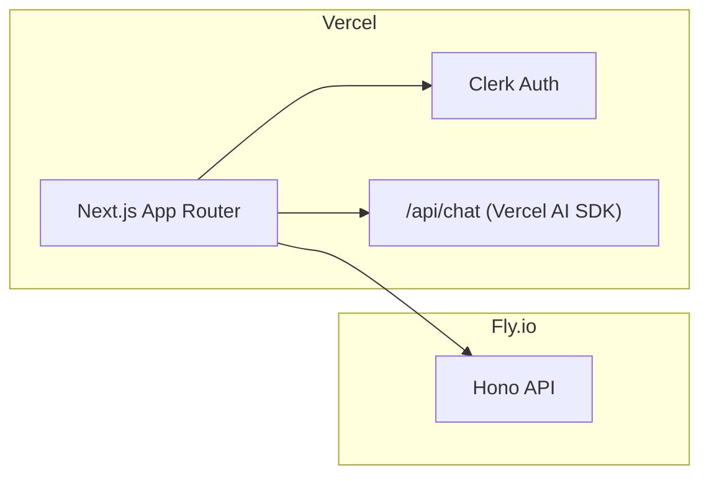

# Phase 1 — Translation (Frontend) + Frontend Deployment (Vercel)

> **Objective**: Translate the Pulse frontend to **Next.js 14 App Router**, preserve layout/UX, implement new sections (Risk Flow / Journal / Econ Calendar), and deploy to **Vercel**.
>
> **Source of truth for layout**: [`pulse/PULSE-LAYOUT-PLAN.md`](pulse/PULSE-LAYOUT-PLAN.md)
>
> **Hard rules**:
> - No emojis.
> - Lucide icons only (no gradients on icons/cards).
> - Gradients allowed **only** inside KPI graphs (**AreaLine** fills).
> - Panels collapse/expand from sides only.

---

## Deliverables (What ships in Phase 1)

### 1) AppShell + 3 Layout Modes (preserved)
- **Combined Panels** (TopStepX ON → iframe centered; OFF → Tape expanded center)
- **Tickers Only** (TopStepX full-screen + floating widgets)
- **Moveable Panels** (left/right panels swappable + collapsible)

### 2) Navigation System (Rail + Peek/Pin Sidebar)
- NavRail icons: Tape, Price, Risk Flow, Journal, Econ Calendar
- Peek/Pin sidebar shows labels in order:
  1. The Tape
  2. Price
  3. Risk Flow
  4. Journal
  5. Econ Calendar
  - Bottom: Profile (avatar), Settings, Logout
- Interaction: **Hover peek**, **click pins**, close unpins

### 3) RiskFlow section
KPI Row (4 cards, fixed order):
1. **Selected Instrument ticker** (left)
2. KPI graph (**AreaLine + gradient fill**) (middle-left)
3. KPI graph (**AreaLine + gradient fill**) (middle-right)
4. **News Plan for Day** (right) — sourced from backend Econ interpretation

### 4) Journal section
- Calendar tiles colored by **daily P&L magnitude** (tile background like a card).
- Date detail modal includes:
  - **P&L by time of day**: **Area line** + gradient fill
  - **Emotional resonance by time**: **Area line** + gradient fill
  - Order history table
  - “Chat with Price about this day” (no incident summary)

### 5) Econ Calendar section
Frontend UX only in Phase 1:
- Simple local calendar (non-clickable)
- TradingView econ calendar **iframe**
- “Focus iframe” / “View on TradingView” toggle
- “Interpret Today” triggers backend route (Phase 3 supports it)

---

## Visual Architecture (Frontend)

---

## UI/Component Map (Implementation-ready)

### Key component responsibilities

| Component | Responsibility |
|----------|----------------|
| `AppShell` | Header + NavRail + Peek/Pin sidebar + layout container |
| `HeaderBar` | Logo slot (GIF), user tier label, TopStepX pill toggle, VIX ticker, layout selector, IV score badge |
| `NavRail` | Icons-only navigation |
| `NavSidebar` | Peek/pin panel labels + profile/settings/logout |
| `LayoutManager` | Switch between Combined/TickersOnly/Moveable |
| `TapePanel` | News feed UI |
| `RiskFlow` | KPI row + sub-panels |
| `Journal` | KPI strip + P&L-colored calendar + date modal |
| `EconCalendar` | Simple calendar + TradingView iframe + interpret button |

---

## Charts + Styling Rules (No slop)

### KPI gradients: allowed only in graph fills
- Allowed: KPI chart components using AreaLine fill gradient.
- Disallowed: gradients in cards, buttons, icons, backgrounds.

### Required chart types
- **P&L by time**: **Area line** chart with gradient fill
- **ER by time**: **Area line** chart with gradient fill

**Implementation note**: Recharts `AreaChart` or equivalent.

---

## Data Contracts (Frontend expects these)

### Journal
- `GET /journal/stats`
- `GET /journal/calendar?month=YYYY-MM`
- `GET /journal/date/YYYY-MM-DD`
- `GET /er/date/YYYY-MM-DD`
- `GET /er/blindspots/YYYY-MM-DD` (optional display as rating only; no “incident summary” required)

### Econ
- `POST /econ/interpret { date, timezone, region }` → `{ events[], planText }`
- `GET /econ/day/YYYY-MM-DD` → cached `{ events[], planText }`

---

## Phase 1 Deployment (Vercel)

### Environment variables (minimum)
- `NEXT_PUBLIC_API_URL` (Fly API base)
- Clerk publishable/secret keys
- AI provider key(s) for Vercel AI SDK

### Release gates (must pass before calling Phase 1 “done”)
- TypeScript strict: **no type holes**
- No emoji usage anywhere in UI
- Gradients only inside KPI graphs
- Navigation rail + peek/pin sidebar behavior matches spec
- Layout modes preserved (Combined/TickersOnly/Moveable)

# Phase 1 — Translation (Frontend) + Frontend Deployment (Vercel)

> **Objective**: Translate Pulse UI to **Next.js 14 (App Router)** and deploy to **Vercel** while preserving layout architecture and adding the finalized sections: **The Tape, Price, Risk Flow, Journal, Econ Calendar**.
>
> **Non-negotiable UI rules**:
> - **No emojis**. Lucide icons only.
> - **No gradients on icons/cards/buttons**. Gradients allowed **only** inside KPI graphs (Area-line fills).
> - Panels collapse/expand **from sides only**.

---

## 1.1 Target Information Architecture

### Sections (Nav order)
1. **The Tape**
2. **Price**
3. **Risk Flow**
4. **Journal**
5. **Econ Calendar**

Bottom actions inside the peek/pin sidebar:
- Profile (avatar)
- Settings
- Logout

### Layout modes (preserved)
- **Combined Panels**
- **Tickers Only**
- **Moveable Panels**

Reference: [`pulse/PULSE-LAYOUT-PLAN.md`](pulse/PULSE-LAYOUT-PLAN.md)

---

## 1.2 Component Architecture (final)

### A) App shell components
- `components/layout/HeaderBar.tsx`
  - `LogoSlot` (GIF drop-in)
  - `{UserTier}` label
  - `TopStepXTogglePill`
  - `VIXTicker`
  - `LayoutModeSelector`
  - `IVScoreBadge`

- `components/navigation/NavRail.tsx` (icons only, always visible)
- `components/navigation/NavSidebar.tsx` (peek/pin sidebar with labels + profile/settings/logout)
- `components/layout/SidePanel.tsx` (horizontal collapse from sides)
- `components/layout/LayoutManager.tsx` (Combined/TickersOnly/Moveable)

### B) The Tape
- `components/tape/TheTape.tsx`
- `components/tape/NewsCard.tsx`
  - Sentiment icon: `TrendingUp` / `TrendingDown` / `Minus` (color only)
  - “breaking” indicator: `Zap` (color only)

### C) Price (AI Agent)
- `components/price/PriceChat.tsx` (ChatInterface)
- `components/price/ChatContextBanner.tsx` (when launched from Journal day modal)

### D) Risk Flow
- `components/riskflow/RiskFlowPage.tsx`
- `components/riskflow/KPIRow.tsx` (4 cards fixed order)
  - Card1: **SelectedInstrumentTicker** (no gradient)
  - Card2: **AreaLine KPI chart** (gradient fill allowed)
  - Card3: **AreaLine KPI chart** (gradient fill allowed)
  - Card4: **NewsPlanForDayTicker** (macro plan) (no gradient)

### E) Journal
- `components/journal/JournalPage.tsx`
- `components/journal/JournalCalendar.tsx`
  - Day tiles colored by daily P&L (tile background = card-like)
- `components/journal/DayDetailModal.tsx`
  - P&L by time-of-day: **Area line + gradient fill**
  - Emotional resonance by time: **Area line + gradient fill**
  - Order history table
  - “Chat with Price about this day” button
  - **No incident summary**

### F) Econ Calendar
- `components/econ/EconCalendarPage.tsx`
  - Simple local calendar (non-clickable)
  - TradingView iframe
  - “Focus iframe” toggle (view on TradingView in iframe)
  - “Interpret Today” button (calls backend; see Phase 3)
  - Plan/events display panel (from backend interpretation)

---

## 1.3 Chart Requirements (strict)

### Area-line charts (gradient fill allowed only here)
Use an area chart implementation (e.g., Recharts `AreaChart`), with a single brand-gradient fill:
- P&L by time-of-day (Journal modal)
- Emotional resonance by time (Journal modal)
- RiskFlow KPI graphs (Card2/Card3 only)

**No other gradients anywhere** (icons, cards, buttons, badges).

---

## 1.4 Journal Calendar Coloring (tile background)

### Color mapping
Calendar day tiles should look like “mini cards” and be colored based on daily P&L:
- Profit day: green-tinted background
- Loss day: red-tinted background
- Near zero: neutral/amber background

### Intensity scaling
Scale intensity by magnitude, bounded to avoid neon overload:
- Compute `absPnL = min(abs(pnl), cap)`
- Normalize `t = absPnL / cap`
- Apply `alpha = lerp(0.10, 0.35, t)` (example)
- Background uses alpha overlay on base panel background

---

## 1.5 Econ Calendar (frontend behavior)

### UX intent
We do **not** build a full econ calendar product.
We embed TradingView for viewing, then use backend interpretation for fast summaries.

### UI behavior
- The local calendar is **non-clickable** (orientation only).
- TradingView iframe is the primary viewing experience.
- “Focus iframe” toggle enlarges/centers the iframe section.
- “Interpret Today” sends request to backend to retrieve plan/events extracted from TradingView screenshot.

---

## 1.6 Frontend API Contracts (consumed from Fly API)

### A) Journal
- `GET /journal/stats?startDate=&endDate=` → KPIs
- `GET /journal/calendar?month=YYYY-MM` → day tiles with pnl + status
- `GET /journal/date/:date` → orders + pnlByTime series

### B) ER + Blindspot
- `GET /er/date/:date` → ER series by hour (0–10)
- `GET /er/blindspots/:date` → rating (0–10) + short summary

### C) Econ plan
- `GET /econ/day/:date` → cached plan/events (fast)
- `POST /econ/interpret` → triggers/refreshes extraction (Phase 3)

---

## 1.7 Deployment (Vercel)

### Key environment variables
- Clerk keys
- `NEXT_PUBLIC_API_URL` → Fly API base URL
- AI provider keys (for Price chat streaming in Next.js)

### Frontend deploy checklist
- App Router strict TS
- Clerk middleware
- CORS validated against Fly
- iframe `frame-src` CSP includes TradingView + TopStepX domains

---

## 1.8 Phase 1 Exit Criteria
- NavRail + peek/pin sidebar works (hover peek + click pin)
- Layout modes preserved (Combined / Tickers Only / Moveable)
- RiskFlow KPI row uses correct card meanings (selected instrument + daily plan)
- Journal calendar tiles are colored by P&L
- Day detail modal shows **area-line** P&L and ER (gradient fill)
- Econ page embeds TradingView iframe and can request interpretation from backend
- Deployed to Vercel

