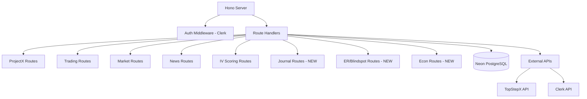

# Phase 2 — Translation/Migration (Backend)

> **Objective**: Translate Encore backend services to **Hono** framework with **Neon PostgreSQL**, preserving all existing functionality and adding new routes for **Journal, ER/Blindspot, and Econ Calendar** data.

> **Non-negotiable rules**:
> - Remove all Encore dependencies.
> - Use Hono for routing.
> - Use Neon Postgres (migrate from Encore-managed DB).
> - Type-safe with Zod validation.
> - No deployment yet (Phase 3).

---

## 2.1 Architecture Overview



---

## 2.2 Core Route Migration

### A) ProjectX Routes (`/projectx/*`)
Migrate from `backend/projectx/encore.service.ts`:

- `GET /projectx/accounts` - List user accounts
- `POST /projectx/sync` - Sync TopStepX accounts
- `GET /projectx/orders` - List orders
- `POST /projectx/orders` - Place order
- `GET /projectx/contracts/:symbol` - Get contract info

### B) Trading Routes (`/trading/*`)
Migrate from `backend/trading/encore.service.ts`:

- `POST /trading/record` - Record trade
- `GET /trading/history` - Get trade history with pagination

### C) Market Routes (`/market/*`)
Migrate from `backend/market/encore.service.ts`:

- `GET /market/data/:symbol` - Get market data
- `GET /market/bars/:symbol` - Get historical bars
- `GET /market/vix` - Get VIX data

### D) News Routes (`/news/*`)
Migrate from `backend/news/`:

- `GET /news/feed` - News feed with IV impact + sentiment

### E) IV Scoring Routes (`/iv-scoring/*`)
New route (calculations):

- `GET /iv-scoring/calculate?symbol=MNQ` - Calculate IV score + implied points

---

## 2.3 Journal Routes (NEW)

### `GET /journal/stats`
Returns aggregated trading statistics for journal KPIs.

**Query params:**
- `startDate` (optional, ISO string)
- `endDate` (optional, ISO string)

**Response:**
```typescript
{
  winRate: number;        // Percentage (e.g., 68.5)
  avgPnL: number;         // Average P&L per trade
  totalTrades: number;    // Total count
  totalPnL: number;       // Sum of all P&L
  profitFactor: number;   // Gross profit / gross loss
  bestTrade: number;      // Highest single trade P&L
  worstTrade: number;     // Lowest single trade P&L
  currentStreak: {        // Current win/loss streak
    type: 'win' | 'loss';
    count: number;
  };
}
```

**Implementation:**
```typescript
// src/routes/journal.ts
journalRoutes.get('/stats', async (c) => {
  const userId = c.get('userId');
  const startDate = c.req.query('startDate') || '1970-01-01';
  const endDate = c.req.query('endDate') || new Date().toISOString();
  
  // Aggregate from trades table
  const [stats] = await sql`
    SELECT
      COUNT(*) as total_trades,
      COUNT(*) FILTER (WHERE pnl > 0) as winning_trades,
      ROUND(AVG(pnl)::numeric, 2) as avg_pnl,
      ROUND(SUM(pnl)::numeric, 2) as total_pnl,
      MAX(pnl) as best_trade,
      MIN(pnl) as worst_trade,
      ROUND(SUM(CASE WHEN pnl > 0 THEN pnl ELSE 0 END)::numeric, 2) as gross_profit,
      ROUND(ABS(SUM(CASE WHEN pnl < 0 THEN pnl ELSE 0 END))::numeric, 2) as gross_loss
    FROM trades
    WHERE user_id = ${userId}
      AND opened_at >= ${startDate}
      AND opened_at <= ${endDate}
  `;
  
  // Calculate win rate
  const winRate = stats.total_trades > 0
    ? Math.round((stats.winning_trades / stats.total_trades) * 100 * 10) / 10
    : 0;
  
  // Calculate profit factor
  const profitFactor = stats.gross_loss > 0
    ? Math.round((stats.gross_profit / stats.gross_loss) * 10) / 10
    : stats.gross_profit;
  
  // Calculate current streak
  const recentTrades = await sql`
    SELECT pnl > 0 as is_win
    FROM trades
    WHERE user_id = ${userId}
    ORDER BY closed_at DESC NULLS LAST, opened_at DESC
    LIMIT 10
  `;
  
  let streak = { type: 'win' as const, count: 0 };
  for (const trade of recentTrades) {
    if (streak.count === 0) {
      streak.type = trade.is_win ? 'win' : 'loss';
      streak.count = 1;
    } else if ((trade.is_win && streak.type === 'win') || (!trade.is_win && streak.type === 'loss')) {
      streak.count++;
    } else {
      break;
    }
  }
  
  return c.json({
    winRate,
    avgPnL: stats.avg_pnl || 0,
    totalTrades: stats.total_trades || 0,
    totalPnL: stats.total_pnl || 0,
    profitFactor,
    bestTrade: stats.best_trade || 0,
    worstTrade: stats.worst_trade || 0,
    currentStreak: streak,
  });
});
```

### `GET /journal/calendar`
Returns P&L status for each day in a month (for calendar tile coloring).

**Query params:**
- `month` (required, format: `YYYY-MM`)

**Response:**
```typescript
{
  days: Array<{
    date: string;           // YYYY-MM-DD
    pnl: number;            // Daily P&L
    tradeCount: number;     // Number of trades
    status: 'profitable' | 'loss' | 'breakeven' | 'no-trades';
  }>;
}
```

**Implementation:**
```typescript
journalRoutes.get('/calendar', async (c) => {
  const userId = c.get('userId');
  const month = c.req.query('month'); // YYYY-MM
  
  if (!month) {
    return c.json({ error: 'month parameter required (YYYY-MM)' }, 400);
  }
  
  const startOfMonth = `${month}-01`;
  const endOfMonth = `${month}-31`; // Will be clamped by actual month end
  
  const days = await sql`
    SELECT
      DATE(opened_at) as date,
      ROUND(SUM(pnl)::numeric, 2) as pnl,
      COUNT(*) as trade_count
    FROM trades
    WHERE user_id = ${userId}
      AND DATE(opened_at) >= ${startOfMonth}
      AND DATE(opened_at) <= ${endOfMonth}
    GROUP BY DATE(opened_at)
    ORDER BY date
  `;
  
  return c.json({
    days: days.map(day => ({
      date: day.date,
      pnl: day.pnl,
      tradeCount: day.trade_count,
      status: day.pnl > 0 ? 'profitable'
            : day.pnl < 0 ? 'loss'
            : day.trade_count > 0 ? 'breakeven'
            : 'no-trades',
    })),
  });
});
```

### `GET /journal/date/:date`
Returns detailed breakdown for a specific date (for day detail modal).

**Path params:**
- `date` (format: `YYYY-MM-DD`)

**Response:**
```typescript
{
  date: string;
  netPnL: number;
  pnlByTime: Array<{ hour: number; pnl: number }>;
  orders: Array<{
    id: number;
    time: string;           // ISO timestamp
    symbol: string;
    side: 'long' | 'short';
    size: number;
    entryPrice: number;
    exitPrice: number;
    pnl: number;
  }>;
}
```

**Implementation:**
```typescript
journalRoutes.get('/date/:date', async (c) => {
  const userId = c.get('userId');
  const date = c.req.param('date'); // YYYY-MM-DD
  
  // Get all orders for that day
  const orders = await sql`
    SELECT
      id, opened_at as "time", symbol, side, size,
      entry_price as "entryPrice", exit_price as "exitPrice", pnl
    FROM trades
    WHERE user_id = ${userId}
      AND DATE(opened_at) = ${date}
    ORDER BY opened_at
  `;
  
  // Calculate P&L by hour
  const pnlByTime = await sql`
    SELECT
      EXTRACT(HOUR FROM opened_at)::integer as hour,
      ROUND(SUM(pnl)::numeric, 2) as pnl
    FROM trades
    WHERE user_id = ${userId}
      AND DATE(opened_at) = ${date}
    GROUP BY EXTRACT(HOUR FROM opened_at)
    ORDER BY hour
  `;
  
  // Get net P&L
  const [totals] = await sql`
    SELECT ROUND(SUM(pnl)::numeric, 2) as net_pnl
    FROM trades
    WHERE user_id = ${userId}
      AND DATE(opened_at) = ${date}
  `;
  
  return c.json({
    date,
    netPnL: totals?.net_pnl || 0,
    pnlByTime: pnlByTime.map(p => ({ hour: p.hour, pnl: p.pnl })),
    orders: orders.map(o => ({
      id: o.id,
      time: o.time,
      symbol: o.symbol,
      side: o.side,
      size: o.size,
      entryPrice: o.entryPrice,
      exitPrice: o.exitPrice,
      pnl: o.pnl,
    })),
  });
});
```

---

## 2.4 ER/Blindspot Routes (NEW)

### `GET /er/date/:date`
Returns Emotional Resonance scores by hour for a specific date.

**Path params:**
- `date` (format: `YYYY-MM-DD`)

**Response:**
```typescript
{
  erByTime: Array<{
    hour: number;           // 0-23
    score: number;          // 0-10
  }>;
}
```

**Implementation:**
```typescript
// src/routes/er.ts
erRoutes.get('/date/:date', async (c) => {
  const userId = c.get('userId');
  const date = c.req.param('date');
  
  // Check if we have stored ER scores
  const storedScores = await sql`
    SELECT hour, score
    FROM emotional_resonance_scores
    WHERE user_id = ${userId}
      AND DATE(recorded_at) = ${date}
    ORDER BY hour
  `;
  
  if (storedScores.length > 0) {
    return c.json({
      erByTime: storedScores.map(s => ({ hour: s.hour, score: s.score })),
    });
  }
  
  // Otherwise, calculate from trading patterns
  const tradePatterns = await sql`
    SELECT
      EXTRACT(HOUR FROM opened_at)::integer as hour,
      COUNT(*) as trade_count,
      SUM(CASE WHEN pnl < 0 THEN 1 ELSE 0 END) as losses,
      SUM(CASE WHEN pnl < 0 AND 
        LAG(pnl) OVER (ORDER BY opened_at) < 0 THEN 1 ELSE 0 END) as revenge_trades
    FROM trades
    WHERE user_id = ${userId}
      AND DATE(opened_at) = ${date}
    GROUP BY EXTRACT(HOUR FROM opened_at)
    ORDER BY hour
  `;
  
  // Calculate ER score per hour (higher = more emotional trading)
  const erByTime = tradePatterns.map(p => {
    const revengeRatio = p.revenge_trades / Math.max(p.losses, 1);
    const overtradingFactor = Math.min(p.trade_count / 5, 2);
    const score = Math.min(10, (revengeRatio * 3 + overtradingFactor * 2));
    return {
      hour: p.hour,
      score: Math.round(score * 10) / 10,
    };
  });
  
  return c.json({ erByTime });
});
```

### `GET /er/blindspots/:date`
Returns Blindspot Management Rating (0-10) for a specific date.

**Path params:**
- `date` (format: `YYYY-MM-DD`)

**Response:**
```typescript
{
  score: number;           // 0-10
  summary: string;         // Short summary (e.g., "Good awareness but watch revenge trading")
}
```

**Implementation:**
```typescript
erRoutes.get('/blindspots/:date', async (c) => {
  const userId = c.get('userId');
  const date = c.req.param('date');
  
  // Check if we have stored rating
  const [stored] = await sql`
    SELECT rating as score, notes as summary
    FROM blindspot_ratings
    WHERE user_id = ${userId}
      AND DATE(recorded_at) = ${date}
    LIMIT 1
  `;
  
  if (stored) {
    return c.json({
      score: stored.score,
      summary: stored.summary || 'No summary available',
    });
  }
  
  // Otherwise, analyze trading patterns
  const patterns = await sql`
    SELECT
      COUNT(*) as total_trades,
      SUM(CASE WHEN pnl < 0 AND 
        LAG(pnl) OVER (ORDER BY opened_at) < 0 THEN 1 ELSE 0 END) as revenge_count,
      SUM(CASE WHEN EXTRACT(HOUR FROM opened_at) < 9 OR 
        EXTRACT(HOUR FROM opened_at) > 15 THEN 1 ELSE 0 END) as off_hours_count,
      AVG(size) as avg_size,
      MAX(size) as max_size
    FROM trades
    WHERE user_id = ${userId}
      AND DATE(opened_at) = ${date}
  `;
  
  const p = patterns[0] || {};
  
  // Calculate blindspot rating (10 = perfect awareness, 0 = major issues)
  let score = 10;
  const issues: string[] = [];
  
  // Deduct for revenge trading
  if (p.revenge_count > 0) {
    score -= p.revenge_count * 1.5;
    issues.push('revenge trading detected');
  }
  
  // Deduct for off-hours trading
  if (p.off_hours_count > 2) {
    score -= 1;
    issues.push('excessive off-hours trading');
  }
  
  // Deduct for size inconsistency
  if (p.max_size > p.avg_size * 2) {
    score -= 1.5;
    issues.push('position size inconsistency');
  }
  
  score = Math.max(0, Math.round(score * 10) / 10);
  
  const summary = score >= 8 ? 'Excellent blindspot awareness'
                : score >= 5 ? `Good awareness with some lapses: ${issues.join(', ')}`
                : `Significant blindspots detected: ${issues.join(', ')}`;
  
  return c.json({ score, summary });
});
```

---

## 2.5 Database Schema Additions

### Migration: `4_create_journal_tables.up.sql`

```sql
-- Emotional Resonance Scores by hour
CREATE TABLE IF NOT EXISTS emotional_resonance_scores (
  id SERIAL PRIMARY KEY,
  user_id VARCHAR(255) NOT NULL,
  recorded_at DATE NOT NULL,
  hour INTEGER NOT NULL CHECK (hour >= 0 AND hour <= 23),
  score DECIMAL(3, 1) NOT NULL CHECK (score >= 0 AND score <= 10),
  label VARCHAR(255),
  created_at TIMESTAMP DEFAULT NOW(),
  UNIQUE(user_id, recorded_at, hour)
);

CREATE INDEX idx_er_scores_user_date ON emotional_resonance_scores(user_id, recorded_at);

-- Blindspot Management Ratings by day
CREATE TABLE IF NOT EXISTS blindspot_ratings (
  id SERIAL PRIMARY KEY,
  user_id VARCHAR(255) NOT NULL,
  recorded_at DATE NOT NULL,
  rating INTEGER NOT NULL CHECK (rating >= 0 AND rating <= 10),
  notes TEXT,
  created_at TIMESTAMP DEFAULT NOW(),
  UNIQUE(user_id, recorded_at)
);

CREATE INDEX idx_blindspot_user_date ON blindspot_ratings(user_id, recorded_at);

-- Add indexes to trades table for journal queries
CREATE INDEX IF NOT EXISTS idx_trades_user_date ON trades(user_id, DATE(opened_at));
CREATE INDEX IF NOT EXISTS idx_trades_user_month ON trades(user_id, EXTRACT(MONTH FROM opened_at), EXTRACT(YEAR FROM opened_at));
```

### Rollback: `4_create_journal_tables.down.sql`

```sql
DROP TABLE IF EXISTS emotional_resonance_scores;
DROP TABLE IF EXISTS blindspot_ratings;
DROP INDEX IF EXISTS idx_trades_user_date;
DROP INDEX IF EXISTS idx_trades_user_month;
```

---

## 2.6 Encore → Hono Translation Guide

| Encore Pattern | Hono Equivalent |
|---------------|-----------------|
| `api({ method: "POST", path: "/x" }, handler)` | `app.post('/x', handler)` |
| `getAuthData()!.userID` | `c.get('userId')` (from auth middleware) |
| `db.query\`SELECT...\`` | `sql\`SELECT...\`` (postgres client) |
| `db.queryRow\`...\`` | `const [row] = await sql\`...\`` |
| `secret("Name")` | `env.NAME` (from env.ts) |
| `log.info(...)` | `console.log(...)` or pino logger |
| `APIError.notFound(...)` | `c.json({ error: '...' }, 404)` |

---

## 2.7 Phase 2 Exit Criteria

- All Encore dependencies removed
- All core routes migrated (ProjectX, Trading, Market, News, IV Scoring)
- Journal routes implemented (`/journal/stats`, `/journal/calendar`, `/journal/date/:date`)
- ER/Blindspot routes implemented (`/er/date/:date`, `/er/blindspots/:date`)
- Database migrations created and tested locally
- All routes return correct data structures
- Type-safe with Zod validation
- **No deployment yet** (Phase 3)

---

## 2.8 Testing (Local)

### Manual API Testing
Use `curl` or Postman to test endpoints locally:

```bash
# Start local server
npm run dev

# Test journal stats
curl -H "Authorization: Bearer $TOKEN" http://localhost:8080/journal/stats

# Test calendar
curl -H "Authorization: Bearer $TOKEN" "http://localhost:8080/journal/calendar?month=2025-12"

# Test date detail
curl -H "Authorization: Bearer $TOKEN" http://localhost:8080/journal/date/2025-12-15
```

### Database Validation
```sql
-- Verify tables exist
SELECT table_name FROM information_schema.tables WHERE table_schema = 'public';

-- Verify indexes
SELECT indexname, indexdef FROM pg_indexes WHERE tablename = 'trades';
```
